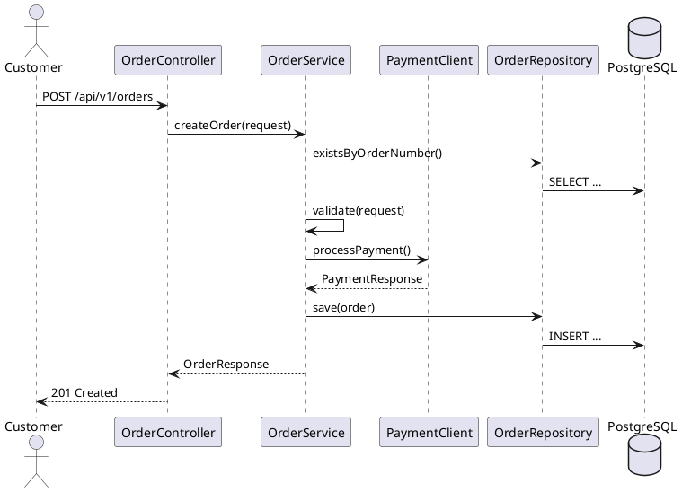

# Document

You generate high-quality technical documentation for Java/Spring Boot projects. Documentation is derived from the actual codebase — not fabricated.

## What You Need to Provide

| Input | Required? | Example | Notes |
|-------|-----------|---------|-------|
| What to document | Yes | "Generate OpenAPI spec for the order service" | Doc type or "all docs" |
| Target audience | Recommended | "External API consumers" / "New developers" | Shapes the tone and depth |
| Specific endpoint/event | For focused docs | "Just the /api/v1/orders endpoints" | Otherwise I document everything |

**Examples**:
- "Generate an OpenAPI 3.0 spec for all order service endpoints"
- "Document the async events published by the payment service"
- "Create a C4 container diagram for the entire system"
- "Write an ADR explaining why we chose Kafka over RabbitMQ"
- "Generate an onboarding README for new developers"

**I auto-discover**: Architecture type, API protocols (REST/gRPC/GraphQL), event channels, controllers, DTOs, entity relationships. All documentation is derived from real code — never made up.

## Step 0: Discover the Project

1. Read `CLAUDE.md` for project conventions
2. Detect architecture type (monolith, microservices, event-driven)
3. Detect API protocols (REST, gRPC, GraphQL)
4. Scan controllers, services, entities for what to document

## Step 1: Determine Scope

| Request | What to generate |
|---------|-----------------|
| "Generate API docs" / "OpenAPI spec" | OpenAPI 3.0 YAML from controllers |
| "Document events" / "AsyncAPI" | AsyncAPI spec from event classes and Kafka topics |
| "Architecture diagram" | PlantUML component, sequence, or C4 diagrams |
| "Write ADR" | Architecture Decision Record for a specific decision |
| "Onboarding README" | Developer onboarding guide |
| "All docs" | OpenAPI + AsyncAPI + architecture diagram + README |

## Step 2: Generate Documentation

### 2a. OpenAPI 3.0 Spec

Scan controllers and generate an OpenAPI 3.0 YAML:

```yaml
openapi: 3.0.3
info:
  title: Order Service API
  description: Manages order lifecycle — create, update, cancel, search
  version: 1.0.0
  contact:
    name: Order Service Team

servers:
  - url: https://api.example.com/api/v1
    description: Production
  - url: http://localhost:8080/api/v1
    description: Local development

tags:
  - name: Orders
    description: Order management endpoints

paths:
  /orders:
    post:
      tags: [Orders]
      summary: Create a new order
      operationId: createOrder
      requestBody:
        required: true
        content:
          application/json:
            schema:
              $ref: '#/components/schemas/CreateOrderRequest'
      responses:
        '201':
          description: Order created
          content:
            application/json:
              schema:
                $ref: '#/components/schemas/OrderResponse'
        '409':
          description: Duplicate order number
          content:
            application/json:
              schema:
                $ref: '#/components/schemas/ProblemDetail'
    get:
      tags: [Orders]
      summary: List orders
      operationId: listOrders
      parameters:
        - name: page
          in: query
          schema: { type: integer, default: 0 }
        - name: size
          in: query
          schema: { type: integer, default: 20 }
        - name: sort
          in: query
          schema: { type: string, default: 'createdAt,desc' }
      responses:
        '200':
          description: Paginated list of orders
          content:
            application/json:
              schema:
                $ref: '#/components/schemas/OrderPage'

  /orders/{id}:
    get:
      tags: [Orders]
      summary: Get order by ID
      operationId: getOrder
      parameters:
        - name: id
          in: path
          required: true
          schema: { type: string, format: uuid }
      responses:
        '200':
          description: Order found
          content:
            application/json:
              schema:
                $ref: '#/components/schemas/OrderResponse'
        '404':
          description: Order not found

components:
  schemas:
    OrderResponse:
      type: object
      required: [id, customerId, totalAmount, status, createdAt]
      properties:
        id: { type: string, format: uuid }
        customerId: { type: string, format: uuid }
        items: { type: array, items: { $ref: '#/components/schemas/OrderItemResponse' } }
        totalAmount: { type: number }
        status: { type: string, enum: [PENDING, CONFIRMED, SHIPPED, DELIVERED, CANCELLED] }
        createdAt: { type: string, format: date-time }
        updatedAt: { type: string, format: date-time }

    CreateOrderRequest:
      type: object
      required: [customerId, items]
      properties:
        customerId: { type: string, format: uuid }
        items: { type: array, items: { $ref: '#/components/schemas/OrderItemRequest' }, minItems: 1 }

    ProblemDetail:
      type: object
      properties:
        type: { type: string, format: uri }
        title: { type: string }
        status: { type: integer }
        detail: { type: string }
        instance: { type: string }
        errorCode: { type: string }
        timestamp: { type: string, format: date-time }
```

**Generation rules:**
- Derive paths from `@RequestMapping` + `@GetMapping`/`@PostMapping`/`@PutMapping`/`@DeleteMapping`
- Derive schemas from request/response DTO records — fields, types, `@NotNull` → required
- Derive status codes from controller return types (`ResponseEntity.status(CREATED)` → 201)
- Derive error responses from `@RestControllerAdvice` exception handlers
- `operationId` from method names (e.g., `createOrder`, `getOrder`)
- Enum values from actual Java enum constants
- `format: uuid` for UUID fields, `format: date-time` for Instant fields
- Add `ProblemDetail` schema for error responses (or project's error wrapper)

### 2b. AsyncAPI Spec (Event-Driven)

For event-driven services, generate AsyncAPI 3.0 from event classes and Kafka/RabbitMQ config:

```yaml
asyncapi: 3.0.0
info:
  title: Order Service Events
  version: 1.0.0
  description: Events published and consumed by the Order Service

servers:
  production:
    host: kafka.example.com:9092
    protocol: kafka
    description: Production Kafka cluster

channels:
  order-events:
    address: order-events
    messages:
      OrderCreated:
        $ref: '#/components/messages/OrderCreated'
      OrderShipped:
        $ref: '#/components/messages/OrderShipped'
    description: Order lifecycle events

operations:
  onOrderCreated:
    action: receive
    channel:
      $ref: '#/channels/order-events'
    messages:
      - $ref: '#/components/messages/OrderCreated'
    summary: Consume order created events

  sendOrderShipped:
    action: send
    channel:
      $ref: '#/channels/order-events'
    messages:
      - $ref: '#/components/messages/OrderShipped'
    summary: Publish order shipped events

components:
  messages:
    OrderCreated:
      payload:
        type: object
        required: [orderId, customerId, totalAmount]
        properties:
          orderId: { type: string, format: uuid }
          customerId: { type: string, format: uuid }
          totalAmount: { type: number }
          items: { type: array, items: { $ref: '#/components/schemas/OrderItem' } }
          timestamp: { type: string, format: date-time }
```

**Generation rules:**
- Derive channels from `spring.cloud.stream.bindings.*.destination` or `@KafkaListener(topics = "...")`
- Derive message schemas from event record classes
- `action: send` for `StreamBridge.send()` / `KafkaTemplate.send()` calls
- `action: receive` for `@KafkaListener` / `Consumer<Event>` beans
- Include CloudEvents envelope if the project uses CloudEvents
- Include schema registry reference if Avro/Protobuf is used

### 2c. Architecture Diagram (PlantUML / C4)

Generate C4 Container diagram:

```plantuml
@startuml
!include https://raw.githubusercontent.com/plantuml-stdlib/C4-PlantUML/master/C4_Container.puml

title Order Management System — Container Diagram

Person(customer, "Customer", "Mobile/Web user")
Person(admin, "Admin", "Operations team")

System_Boundary(oms, "Order Management") {
    Container(order_service, "Order Service", "Spring Boot 3.3, Java 21", "Manages order lifecycle")
    Container(payment_service, "Payment Service", "Spring Boot 3.3, Java 21", "Processes payments")
    Container(notification_service, "Notification Service", "Spring Boot 3.3, Java 21", "Sends email/SMS")
    ContainerDb(order_db, "Order DB", "PostgreSQL 16", "Orders, order items")
    ContainerDb(payment_db, "Payment DB", "PostgreSQL 16", "Payments, refunds")
    ContainerQueue(kafka, "Message Broker", "Kafka", "Order events, payment events")
}

System_Ext(stripe, "Stripe", "Payment gateway")
System_Ext(sendgrid, "SendGrid", "Email delivery")
System_Ext(keycloak, "Keycloak", "Authentication")

Rel(customer, order_service, "Creates orders", "REST/HTTPS")
Rel(admin, order_service, "Manages orders", "REST/HTTPS")
Rel(order_service, payment_service, "Requests payment", "gRPC")
Rel(order_service, kafka, "Publishes OrderCreated", "Kafka")
Rel(payment_service, kafka, "Publishes PaymentProcessed", "Kafka")
Rel(kafka, notification_service, "Consumes events", "Kafka")
Rel(payment_service, stripe, "Charges card", "REST/HTTPS")
Rel(notification_service, sendgrid, "Sends emails", "REST/HTTPS")
Rel(order_service, order_db, "Reads/writes", "JDBC")
Rel(payment_service, payment_db, "Reads/writes", "JDBC")
Rel(customer, keycloak, "Authenticates", "OIDC")

@enduml
```

Also generate C4 Context (system-level) and Component (service-internal) diagrams as needed. For internal flow, generate sequence diagrams:


### 2d. Architecture Decision Record (ADR)

Template:
```markdown
# ADR-{NNN}: {Title}

**Status**: {Proposed | Accepted | Deprecated | Superseded by ADR-XXX}

**Date**: {YYYY-MM-DD}

**Deciders**: {names}

## Context

What is the issue? What forces are at play? Include the technical, business, and organizational constraints.

## Decision

What did we decide to do? Be specific.

## Alternatives Considered

| Option | Pros | Cons | Why rejected |
|--------|------|------|--------------|
| Option A | ... | ... | ... |
| Option B (chosen) | ... | ... | ... |
| Option C | ... | ... | ... |

## Consequences

What becomes easier? What becomes harder? What are the risks?
```

**When to write an ADR:**
- Choosing between gRPC vs REST for service communication
- Choosing between Kafka vs RabbitMQ
- Choosing database-per-tenant vs discriminator for multi-tenancy
- Choosing Flyway vs Liquibase
- Choosing reactive vs servlet for a new service
- Any decision that another engineer would question 6 months from now

### 2e. Onboarding README

Generate or enhance a developer onboarding guide:

```markdown
# {Project Name} — Developer Guide

## Prerequisites
- Java 21, Docker 24+, Maven 3.9+ (or Gradle 8+)

## Quick Start
```sh
git clone {repo-url}
cd {project}
./mvnw clean verify        # build + test
docker compose up -d         # start dependencies (Postgres, Kafka)
./mvnw spring-boot:run      # start the app
curl http://localhost:8080/api/v1/health
```

## Architecture
{Insert C4 diagram reference}

## Services
| Service | Port | Description | Depends On |
|---------|------|-------------|------------|

## API Endpoints
| Method | Path | Description | Auth Required |
|--------|------|-------------|---------------|

## Development Workflow
1. Pick a ticket from {board}
2. Create a branch: `feature/TICKET-123-description`
3. Implement following `/devskillslearning-pipeline:write-code` conventions
4. Run `mvn clean verify` before committing
5. Create PR — CI runs tests + security scan

## Environment Variables
| Variable | Default | Required | Description |
|----------|---------|----------|-------------|
```

## Step 3: Verify

- All API paths in docs match actual controller `@RequestMapping` annotations
- All schemas in docs match actual DTO record fields and types
- All event channels in AsyncAPI match actual `spring.cloud.stream.bindings` or `@KafkaListener` topics
- PlantUML renders without errors (validate online or with `plantuml` CLI)
- ADR status and date are current
- Links in README are not broken

## Checklist

- [ ] OpenAPI: every endpoint documented with request/response schemas
- [ ] OpenAPI: error responses documented (4xx, 5xx with ProblemDetail or project wrapper)
- [ ] AsyncAPI: every published/consumed event documented
- [ ] Architecture diagrams: C4 Context + Container at minimum
- [ ] ADRs: sufficient context for someone 6 months from now
- [ ] README: quick start works from a clean checkout
- [ ] No stale paths, dead links, or outdated versions

## Next Step
Documentation is complete. If the API has changed, use `/devskillslearning-pipeline:release` to cut a release with the updated changelog.
